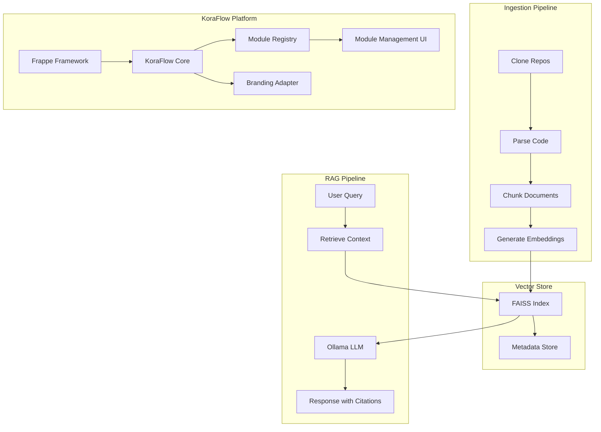

# KoraFlow

A white-label, modular, enterprise platform powered by Frappe Framework with a local LLaMA-based Retrieval-Augmented Generation (RAG) system.

## Overview

KoraFlow is a complete rebranding and enhancement of Frappe Framework and ERPNext, providing:

- **Local LLM Integration**: Ollama-powered RAG system for AI assistance
- **Complete Source Ingestion**: Frappe Framework and all product source code
- **Documentation Integration**: Official Frappe documentation in vector store
- **UI-First Development**: Configuration-based customization
- **Module System**: Independent activation/deactivation of modules
- **Frontend-Only Branding**: Safe, reversible rebranding without backend changes

## Architecture



## Prerequisites

- **Docker**: Installed and running
- **Python 3.10+**: For Bench and Frappe
- **Git**: For repository cloning
- **Ollama**: Local LLM server (install from [ollama.ai](https://ollama.ai))

### Ollama Setup

1. Install Ollama:
   ```bash
   # macOS
   brew install ollama
   
   # Or download from https://ollama.ai
   ```

2. Pull required models:
   ```bash
   ollama pull llama3
   ollama pull nomic-embed-text
   ```

3. Start Ollama server:
   ```bash
   ollama serve
   ```

## Project Structure

```
KoraFlow/
├── docker-compose.yml          # Docker services configuration
├── config.yml                   # Central configuration
├── bench_setup.sh              # Frappe/Bench installation script
├── README.md                   # This file
│
├── ingestion/                  # Source ingestion service
│   ├── Dockerfile
│   ├── requirements.txt
│   ├── clone_repos.py          # Clone GitHub repositories
│   ├── scrape_docs.py          # Scrape documentation
│   ├── parse_code.py           # Parse Python/JS files
│   └── chunk_documents.py      # Chunk into normalized JSON
│
├── vector_store/               # FAISS vector store service
│   ├── Dockerfile
│   ├── requirements.txt
│   ├── faiss_manager.py        # FAISS index management
│   └── embeddings.py           # Embedding generation
│
├── llm_service/                # RAG pipeline service
│   ├── Dockerfile
│   ├── requirements.txt
│   ├── ollama_client.py        # Ollama API client
│   ├── faiss_manager.py        # FAISS integration
│   └── rag_pipeline.py         # RAG pipeline with citations
│
├── apps/                       # Frappe apps
│   └── koraflow_core/          # KoraFlow Core app
│       ├── setup.py
│       └── koraflow_core/
│           ├── hooks.py        # Frappe hooks
│           ├── branding.py     # Branding adapter
│           ├── module_registry.py  # Module management
│           └── doctype/
│               └── koraflow_module/  # Module DocType
│
├── repos/                      # Cloned repositories (generated)
├── docs/                       # Scraped documentation (generated)
└── chunks/                     # Chunked documents (generated)
```

## Quick Start

### 1. Clone and Setup

```bash
# Clone the repository
git clone <repository-url>
cd KoraFlow

# Initialize git branches
git checkout -b main
git checkout -b production
git checkout main
```

### 2. Configure

Edit `config.yml` to customize:
- Ollama host/port (default: `host.docker.internal:11434`)
- Model names (default: `llama3` for LLM, `nomic-embed-text` for embeddings)
- Chunk size and retrieval parameters
- Repository branches

### 3. Start Docker Services

```bash
# Start ingestion, vector store, and LLM services
docker-compose up -d

# Check service status
docker-compose ps
```

### 4. Run Ingestion Pipeline

```bash
# Clone repositories
docker-compose run --rm ingestion python clone_repos.py

# Scrape documentation
docker-compose run --rm ingestion python scrape_docs.py

# Parse code files
docker-compose run --rm ingestion python parse_code.py

# Chunk documents
docker-compose run --rm ingestion python chunk_documents.py
```

### 5. Build Vector Store

```bash
# Generate embeddings and build FAISS index
docker-compose run --rm vector_store python faiss_manager.py
```

### 6. Start RAG Service

```bash
# Start the RAG pipeline API
docker-compose up llm_service

# Test the service
curl http://localhost:8000/health
```

### 7. Setup Frappe/Bench

```bash
# Run bench setup script
./bench_setup.sh

# Or manually:
bench init --frappe-branch version-14 bench
cd bench
bench new-site koraflow-site
bench get-app erpnext --branch version-14
bench --site koraflow-site install-app erpnext
# ... install other modules
```

### 8. Install KoraFlow Core

```bash
cd bench
bench get-app koraflow_core /path/to/KoraFlow/apps/koraflow_core
bench --site koraflow-site install-app koraflow_core
bench start
```

## Configuration

### config.yml

Main configuration file with sections:

- **repositories**: GitHub repos to ingest
- **documentation**: Documentation URLs to scrape
- **ollama**: Ollama connection and model settings
- **chunking**: Chunk size and overlap parameters
- **retrieval**: Top-K and similarity threshold
- **faiss**: FAISS index configuration
- **embeddings**: Embedding model settings

### Environment Variables

- `OLLAMA_HOST`: Ollama host (default: `host.docker.internal`)
- `OLLAMA_PORT`: Ollama port (default: `11434`)

## Usage

### RAG Pipeline API

The RAG pipeline exposes a FastAPI endpoint:

```bash
# Query the system
curl -X POST http://localhost:8000/query \
  -H "Content-Type: application/json" \
  -d '{
    "query": "How do I create a custom DocType?",
    "top_k": 5
  }'
```

Response includes:
- `answer`: Generated answer with citations
- `citations`: List of source citations
- `retrieved_chunks`: Number of chunks retrieved

### Module Management

Access module management via:
- Desk UI: "KoraFlow Modules" DocType
- API: `/api/method/koraflow_core.koraflow_core.module_registry.get_all_modules_status`

### Branding

Branding is applied automatically via:
- Workspace labels
- Sidebar entries
- App titles
- UI labels

No backend changes required - all branding is frontend-only.

## Module Activation/Deactivation

Modules can be enabled/disabled via:

1. **DocType UI**: Create/edit "KoraFlow Module" records
2. **API**: Use `toggle_module` method
3. **Site Config**: Direct configuration in `site_config.json`

When a module is disabled:
- UI hidden (workspaces, sidebar entries)
- Routes blocked
- APIs return safe errors
- Reports/dashboards hidden

## Development

### Adding New Modules

1. Install the Frappe app
2. Create module entry in KoraFlow Module DocType
3. Apply branding via Workspace Editor
4. Configure module visibility rules

### Customizing Branding

Edit `apps/koraflow_core/koraflow_core/hooks.py`:
- Update `get_branding_map()` function
- Add new name mappings
- Rebuild assets: `bench build`

### Extending RAG Pipeline

1. Modify `llm_service/rag_pipeline.py`
2. Add custom retrieval logic
3. Extend citation formats
4. Rebuild Docker image: `docker-compose build llm_service`

## Testing

### Run Bench Tests

```bash
cd bench
bench run-tests --app koraflow_core
```

### Test RAG Pipeline

```bash
# Health check
curl http://localhost:8000/health

# Test query
curl -X POST http://localhost:8000/query \
  -H "Content-Type: application/json" \
  -d '{"query": "test query"}'
```

### Verify Module System

```bash
# Check module status
curl http://localhost:8000/api/method/koraflow_core.koraflow_core.module_registry.get_all_modules_status
```

## Troubleshooting

### Ollama Connection Issues

- Verify Ollama is running: `ollama list`
- Check Docker network: `docker network inspect koraflow_koraflow-network`
- Update `OLLAMA_HOST` in docker-compose.yml if needed

### FAISS Index Not Found

- Run `faiss_manager.py` to build index
- Check `vector_store/indices/` directory
- Verify chunks exist in `chunks/` directory

### Module Not Showing

- Check module is enabled in KoraFlow Module DocType
- Verify module is installed: `bench list-apps`
- Check workspace visibility rules
- Clear cache: `bench clear-cache`

### Branding Not Applied

- Rebuild assets: `bench build`
- Clear browser cache
- Check hooks.py branding map
- Verify workspace labels

## Safety & Audit

### Change Control

- All changes via VS Code only
- Branch naming: `task/<name>-<timestamp>`
- Commits include citations
- PR descriptions with test results

### Validation Rules

- No direct SQL (read-only if needed)
- No schema changes outside DocType tools
- No destructive actions without preview
- All changes reference official docs

## Citation Format

The system uses standardized citation formats:

- **Code**: `repo/path/file.py#L10-L40@commitSHA`
- **Documentation**: `docs.frappe.io/path#Heading`

All RAG responses include citations for traceability.

## Contributing

1. Create feature branch: `task/<feature-name>-<timestamp>`
2. Make changes via VS Code
3. Run tests: `bench run-tests`
4. Commit with citations
5. Create PR with test results

## License

MIT License - See LICENSE file for details

## Support

For issues and questions:
- Check official Frappe documentation: https://docs.frappe.io
- Review KoraFlow Core app documentation
- Consult RAG pipeline for code-specific questions

## Roadmap

- [ ] Enhanced documentation scraping
- [ ] Multi-model support
- [ ] Advanced chunking strategies
- [ ] Real-time index updates
- [ ] Workspace customization UI
- [ ] Module dependency management
- [ ] Automated testing suite

## Acknowledgments

Built on:
- [Frappe Framework](https://frappe.io)
- [ERPNext](https://erpnext.com)
- [Ollama](https://ollama.ai)
- [FAISS](https://github.com/facebookresearch/faiss)
- [Sentence Transformers](https://www.sbert.net/)

